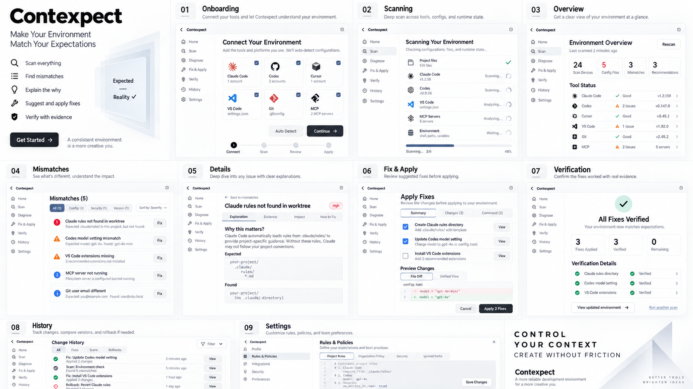

# UI / UX：最终视觉方向与实现规范

**最终方向：白底黑字、黑白高对比、现代、优雅，有设计力度，但不压迫。** 这是用户在本会话最后明确指定的方向。首轮蓝色工作台、后续深色紫蓝科技风和黑底白字均作为历史保留，不作为默认主题。[^CHAT]

本文件把视觉反馈转成可实现建议；除用户明确偏好和已有合同外，具体尺寸、token、动效数值都是待验证建议，不是已批准的生产标准。

## 1. 唯一主视觉参考



原文件：`contexpect产品体验设计总览.png`，1672 × 941，SHA-256 与附件身份见 [资产清单](14_ASSET_MANIFEST.md)。这是生成的设计概念图，不是应用运行截图。图中的9个阶段表达一条体验路径，不代表产品最终只保留9页。[^VIS]

完整包包含原图；纯Markdown包保留本规范和文件身份，但不附PNG。

## 2. 视觉设计原则

现代感来自大而清晰的标题、克制的组件、充分留白、信息密度的节奏、细致的对齐和直接的交互反馈，不来自深色铺满、霓虹光效、彩色玻璃或高亮渐变。

主背景白色，主文字近黑色，次级背景浅灰。黑色实心只给最重要的动作或少量品牌强调，不做大面积黑色侧栏。边框和阴影用于组织内容，不为每块数据都套厚卡片。信息表格、分割线、行内标签优先于无必要的大圆角卡片堆叠。

状态不靠颜色独自传意。默认使用文字、图标、边框与形状区分“已观察”“静态推演”“待补证”“不适用”。少量语义色或品牌图标色若未来采用，必须是局部且可在灰度下理解；本轮不把蓝色重新引为主色。

## 3. 建议 token（不是现有 token 文件的直接替换）

```css
:root {
  --cx-bg: #ffffff;
  --cx-surface: #f7f7f8;
  --cx-surface-raised: #ffffff;
  --cx-text: #111111;
  --cx-text-secondary: #5b5b62;
  --cx-line: #e4e4e7;
  --cx-line-strong: #b5b5bd;
  --cx-action: #151515;
  --cx-action-text: #ffffff;
  --cx-focus: #111111;
  --cx-radius-sm: 6px;
  --cx-radius-md: 10px;
  --cx-space-unit: 4px;
  --cx-motion-fast: 140ms;
  --cx-motion-normal: 200ms;
  --cx-font-ui: -apple-system, BlinkMacSystemFont, "Segoe UI",
    "PingFang SC", "Microsoft YaHei", sans-serif;
  --cx-font-mono: ui-monospace, SFMono-Regular, Consolas, monospace;
}
```

接入时映射现有 `packages/ui-tokens`，不要新建平行 token 权威。字体使用系统回退；不要为了原图中的 Inter 标签默认请求外部字体或把字体文件加入交接包。尺寸和对比度需在实际浏览器/WebView中检查，不能因选了这些值就宣称达到无障碍标准。

## 4. 布局与层次

桌面建议保留轻量侧导航、坐标栏、主区、按需证据侧区。侧栏建议224–240px；证据区建议280–340px，空间不足时进入正常文档流或可关闭drawer，不覆盖主操作。顶栏显示项目、cwd、harness版本/surface和当前Receipt；完整坐标在展开区，不强迫每个字段常驻占据首屏。

正文建议14–16px，说明12–14px，页面标题28–36px。代码、路径、ID采用等宽字；長ID截断时提供可访问的完整查看，不将绝对home暴露到tooltip。长中文、英文和错误码都需换行测试。

首屏顺序应是：**当前项目与范围 → 需要处理的问题 → 证据与未知 → 下一步安全动作**。禁止用一张无出处总分或巨型英雄插画抢走工作的主要空间。

宽屏可三栏，中屏两栏或流式，窄屏优先只读Receipt与通知。具体断点继承现有合同并实测；不要从图上一个手机缩略图推导“已经支持完整手机审批/桌面管理”。

## 5. 各组件的交互要求

| 组件 | 建议表现 | 不应出现 |
| --- | --- | --- |
| 主动作 | 一屏一个明确主要动作：检查、补证、预览或确认 | 每张卡片一个黑色主按钮，失去层级 |
| 状态标签 | 文本+图标，可展开why/how/source | 仅一枚绿色Active覆盖全部facet |
| 问题列表 | 有来源、作用域、确认程度、阻断性；按影响而非纯颜色排序 | Unknown混进高/中/低风险等级 |
| 证据面板 | 默认摘要；按授权查看详细字段；保留时间与覆盖 | 自动展示原始prompt或凭据 |
| Diff | 可切换统一/并排；文本标记新增/删除，灰度也可理解 | 语法相同就显示语义等价 |
| Care Plan | 显示目标、冻结摘要、损失、权限、预计步骤 | 勾选即获得执行权限 |
| 执行进度 | 写入/重扫/原生核验分别显示 | 假进度100%等于所有事实已核验 |
| Command menu | 按已有路由与安全动作检索；危险动作仍确认 | 搜索后直接运行shell |
| 确认对话框 | 默认焦点安全；明确对象和后果；Esc/返回焦点有合同 | 默认勾选发送或批准高风险操作 |
| 通知 | 去重，有上下文与落点；不泄漏敏感文本 | 长时间toast遮挡主操作或永远消失的错误 |

## 6. 为什么不能直接照抄图里的内容

最终图含有演示性的版本、配置和“All Fixes Verified”等概括文案；首轮图还出现混合harness/model坐标、健康百分比、置信分、假设性实验数字和过宽自动修复。它们只是生成模型的图中示例。对生产UI必须应用 [最终纠偏](02_FINAL_DECISIONS_AND_CORRECTIONS.md)。[^VIS][^CHAT]

建议替换：

| 概念图措辞 | 建议实际文案 |
| --- | --- |
| Everything in Sync | 当前范围内未发现新的差异；仍有未覆盖项 |
| All Fixes Verified | 已写入2项；静态检查通过；本轮运行证据待补充（数字由数据计算） |
| Environment Good | 查看本次检查范围与结果 |
| Unknown | 尚无足够证据：具体reason；下一步最小补证动作 |
| Native / Verified | 原生观察到的具体字段、来源、实例和时间 |
| Safe fix | 可预览的修复候选；执行仍需批准与前置条件 |
| 95% confidence | 删除无依据分数，展示支持与反例、适用范围 |

示例文案中的数字不可固定成真实仪表盘数据。尽量使用“在本次快照/此请求/声明范围内”限定，避免不可证实的“所有”“绝对”“完全一致”。

## 7. 响应式、键盘与隐私

所有交互能用键盘到达；可见焦点、skip link、main landmark、单一页面主标题、控件可访问名称与表单内联错误需测试。modal应约束焦点并关闭后归还；常驻侧区不要假装modal。取消/关闭不能扩大原批准权限。

白底黑字不是降低信息可读性的借口。浅灰文字、细边界和disabled态必须在真实设备实测。尊重reduced-motion；不使用长时间循环发光/浮动吸引注意。错误状态不要只靠旋转圈。

截图隐私不仅遮住视觉，还要检查aria、复制、tooltip、toast、导出预览和历史缓存。敏感正文默认纯文本且经授权显示；deep link不能直接揭密、发送、同步或写入。[^R1][^R2]

## 8. 设计完成的定义

白底黑字方向贯穿全部路由；16个既有入口及Advisor/历史所需功能没有被9屏缩略图裁掉。主要路径的正常、空、加载、失败、partial、stale、offline、权限拒绝、未知版本、缺connector都给出原因与下一步；真正不适用的状态标理由，不强造数据。

视觉验收与事实验收分开：用户满意设计，不意味着接受图中所有能力声明；图像构图通过，不意味着存在HTML源码；HTML能点击，不意味着原生工具或后端已互操作。


## 本文依据

[^CHAT]: 本会话可见的用户要求及助手公开分析。过程与效力区分见 [会话决策记录](12_CONVERSATION_DECISION_LOG.md)；未取得独立原文的外部断言不转为工程事实。

[^VIS]: 本会话最后一张《Contexpect 产品体验设计总览》白底黑字概念图；在完整包中为 assets/approved/11_white_monochrome_overview.png。只作为视觉和信息布局参考，不是运行截图或可靠参数表。

[^R1]: 本会话《分环节工程借鉴与整合决策报告》，[原文](originals/Contexpect_Engineering_Reference_and_Integration_Report_2026-09-11.md)。研究快照日期为 2026-09-11；本次仅归档，不重新声明外部项目的最新状态。

[^R2]: 本会话《最终建议与实施决策书》，[原文](originals/Contexpect_Final_Recommendations_2026-09-11.md)。这是最终咨询取舍，不是仓库已接受的新 ADR，也不是已完成的实现。
